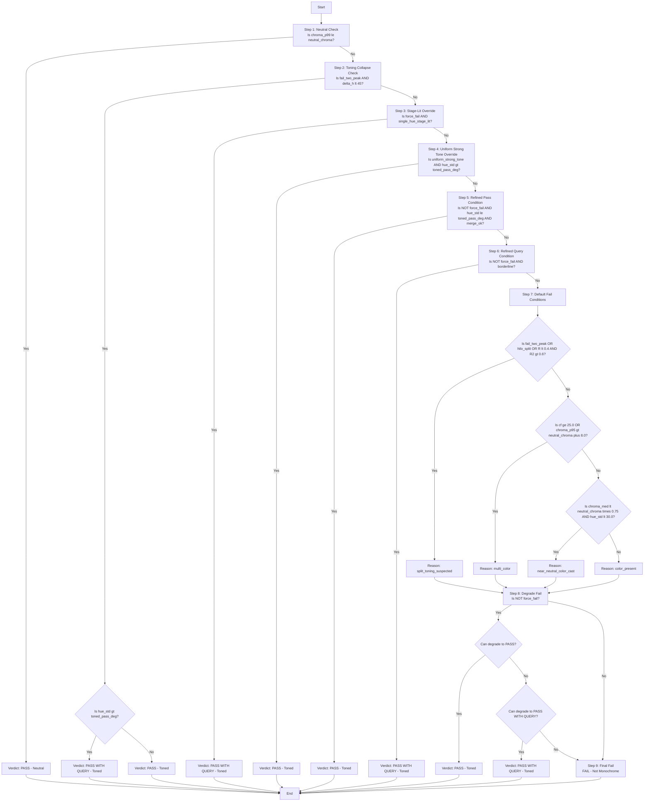

# Monochrome Checker Decision Tree (Technical Reference, v3)

*For a more user-friendly summary, see: [Monochrome Checker Logic](MONOCHROME_CHECKER_LOGIC.md)*

---

## Purpose and Audience

This document is a detailed, technical mapping of the monochrome checker’s logic, written in plain English but closely following the code. It is intended for developers, advanced users, and anyone debugging or extending the checker. Variable names and thresholds are included to help link the explanation to the Python codebase.

---

## Key Concepts, Variables, and Thresholds

The checker's logic relies on a set of specific metrics and configurable thresholds.

| Variable/Concept         | Default   | Description                                                                 |
|-------------------------|-----------|-----------------------------------------------------------------------------|
| neutral_chroma          | 2.0 C*    | A chroma threshold below which pixels are considered essentially neutral.    |
| toned_pass_deg          | 10.0°     | Max circular hue std-dev (σ) for clear PASS as toned monochrome.             |
| toned_query_deg         | 14.0°     | Max hue std-dev (σ) for PASS WITH QUERY.                                    |
| force_fail              | Flag      | Indicates strong, widespread color that should generally fail, unless overridden. |
| uniform_strong_tone     | Override  | Exception for very strong but highly uniform tones.                          |
| single_hue_stage_lit    | Override  | Exception for large neutral shadow region but single-hue subject.            |
| merge_ok                | Condition | True if secondary hue peaks are close (Δh ≤ 12°) or have insignificant mass (<10%). |
| fail_two_peak           | Condition | True if two distinct hue peaks are found, separated by Δh ≥ 15° and secondary mass ≥10%. |
| hilo_split              | Condition | True if hue difference between highlights and shadows is significant (Δh ≥ 45°). |
| R (Hue Concentration)   | Metric    | Resultant length of circular mean of hues (near 1.0 = tight concentration).  |
| R2 (Hue Bimodality)     | Metric    | Resultant length of doubled hues (high >0.6 = two clusters).                 |
| large_drift             | Condition | True if monotonic hue shift across tonal range (abs(hue_drift) > 120°).      |
| LAB_TONED_PASS_DEFAULT  | 10.0      | Default hue std-dev for a toned image to pass.                              |
| LAB_TONED_QUERY_DEFAULT | 14.0      | Default hue std-dev for a toned image to query.                             |
| LAB_STRONG_TONE_HUE_STD | 14.0      | Max hue std-dev for strong uniform tone override.                           |
| LAB_STRONG_TONE_CONCENTRATION | 0.85 | Min hue concentration (R) for strong uniform tone override.                 |
| LAB_STRONG_TONE_PRIMARY_SHARE | 0.97 | Min primary hue share for strong uniform tone override.                     |
| LAB_STRONG_TONE_HUE_TOLERANCE | 15.0 | Degrees for merging close hue peaks.                                        |
| LAB_SHADOW_NEUTRAL_L    | 24.0      | Max L* for shadow region in stage-lit override.                             |
| LAB_SHADOW_NEUTRAL_CHROMA | 2.0     | Max chroma for neutral shadow region.                                       |
| LAB_SHADOW_QUERY_SHARE  | 0.55      | Min shadow share for stage-lit override.                                    |
| LAB_SHADOW_QUERY_HUE_STD | 24.0     | Max hue std-dev for stage-lit override.                                     |
| LAB_SHADOW_QUERY_PRIMARY_SHARE | 0.95 | Min primary hue share for stage-lit override.                               |
| LAB_HARD_FAIL_C4_RATIO_DEFAULT | 0.10 | Min ratio of C*4 pixels for hard fail.                                      |
| LAB_HARD_FAIL_C4_CLUSTER_DEFAULT | 0.08 | Min cluster fraction of C*4 pixels for hard fail.                           |
| CLUSTER_KERNEL_FRACTION | 0.08      | Kernel size fraction for chroma cluster morphology.                         |
| MERGE_DEG               | 12.0      | Max delta hue for two peaks to be considered one color.                     |
| FAIL_DEG                | 15.0      | Min delta hue for two peaks to be considered a genuine split.               |
| MINOR_MASS              | 0.10      | Min mass for a second hue peak to be significant.                           |
| HILO_SPLIT_DEG          | 45.0      | Min delta hue between highs and shadows for split signature.                |

---

## Decision Flow Diagram


The checker evaluates an image through the following sequence of conditions. The first condition met determines the verdict.



---

## Detailed Explanation of Each Step

### Image Loading and Preprocessing

Before any analysis, the image is loaded and standardized:

1.  **Load Image:** The image is opened using `PIL.Image.open()`. Metadata (title, author) is extracted from XMP sidecar files or embedded XMP data.
2.  **ICC Profile Handling:** If an embedded ICC profile is found and `ImageCms` (LittleCMS) is available, the image is converted to sRGB using `ImageCms.profileToProfile()`. Otherwise, it's converted to standard RGB using `im.convert("RGB")`, assuming sRGB if no profile is present or handled.
3.  **Resizing:** If the longest side exceeds `max_side` (default 1024 pixels), the image is downscaled. This involves converting to linear RGB, resizing with `cv2.resize(interpolation=cv2.INTER_AREA)`, and converting back to sRGB.
4.  **Output:** An `np.ndarray` in sRGB (uint8) format and `LoaderDiagnostics` are returned.

### LAB Color Space Conversion and Metrics Calculation

The sRGB image array is converted to the LAB color space for perceptual color analysis.

-   **Conversion:** `lab = cv2.cvtColor(rgb, cv2.COLOR_RGB2LAB).astype(np.float32)`
-   **L* Component:** `L = lab[..., 0] * (100.0 / 255.0)` (Lightness, 0-100)
-   **a* and b* Components:** `a = lab[..., 1] - 128.0`, `b = lab[..., 2] - 128.0` (Color components)
-   **Chroma (C*):** `chroma = np.hypot(a, b)` (Color intensity, distance from neutral axis)
-   **Hue (h°):** `hue_deg_all = (np.degrees(np.arctan2(b, a)) + 360.0) % 360.0` (Color angle, 0-360°)

**Key Chroma Statistics:**

-   `chroma_max`: Maximum chroma value.
-   `chroma_med`: Median chroma value.
-   `chroma_p95`, `chroma_p99`: 95th and 99th percentile chroma values (used to ignore extreme outliers).
-   `chroma_ratio2`, `chroma_ratio4`: Fraction of pixels with chroma > 2.0 and > 4.0 respectively.
-   `cluster_max2`, `cluster_max4`: Largest connected component (cluster) fraction for pixels with chroma > 2.0 and > 4.0, calculated using `_largest_cluster_fraction` (morphological closing with `CLUSTER_KERNEL_FRACTION` kernel, then connected components).

**Chroma-Weighted Circular Hue Statistics:**

-   A `mask` is created for pixels with `chroma > chroma_mask_threshold` (default 2.0). If no pixels meet this, a fallback mask of `chroma > 0.0` is used.
-   `chroma_norm = np.clip(chroma / chroma_max, 0.0, 1.0)` is used as weights.
-   `R` (Hue Concentration): Resultant length of the circular mean of hues, weighted by `chroma_norm`. A value near 1.0 indicates tight concentration.
-   `hue_std_deg`: Circular standard deviation of hues, weighted by `chroma_norm`. Measures hue spread.
-   `R2` (Hue Bimodality): Resultant length of doubled hues, weighted by `chroma_norm`. High values (>0.6) suggest two dominant hue clusters.
-   `mean_hue_deg`: Circular mean hue, weighted by `chroma_norm`.

**Hue Peaks Analysis (`_top_hue_peaks`):**

-   Identifies up to 3 dominant hue peaks using a 36-bin (10° per bin) circular histogram, weighted by `chroma_norm`.
-   Applies circular smoothing and detects local maxima.
-   Merges peaks that are closer than `LAB_STRONG_TONE_HUE_TOLERANCE` (15.0°) into a single peak.
-   `peak_hues`, `peak_weights`: Lists of dominant hue angles and their corresponding chroma-weighted masses.

**Split-Tone Gating Thresholds:**

-   `peak_delta_deg`: Circular difference between the top two hue peaks.
-   `second_mass`: Mass of the second dominant hue peak as a fraction of total weighted mass.
-   `merge_ok`: True if `peak_delta_deg <= MERGE_DEG` (12.0°) OR `second_mass < MINOR_MASS` (0.10).
-   `fail_two_peak`: True if `peak_delta_deg >= FAIL_DEG` (15.0°) AND `second_mass >= MINOR_MASS` (0.10).

**Lightness-Dependent Hue Analysis:**

-   `mean_hue_highs_deg`, `mean_hue_shadows_deg`: Circular mean hues for pixels in the top 25% (highlights) and bottom 25% (shadows) of the L* range, weighted by `chroma_norm`.
-   `delta_h_highs_shadows_deg`: Circular difference between `mean_hue_highs_deg` and `mean_hue_shadows_deg`.
-   `hilo_split`: True if `delta_h_highs_shadows_deg >= HILO_SPLIT_DEG` (45.0°).

**Shadow/Subject Share:**

-   `shadow_mask`: Pixels where `L <= LAB_SHADOW_NEUTRAL_L` (24.0) AND `chroma <= LAB_SHADOW_NEUTRAL_CHROMA` (2.0).
-   `shadow_share`: Fraction of pixels in `shadow_mask`.
-   `subject_share`: `1.0 - shadow_share` (capped at 0.0).

### 1. Neutral Monochrome Check (Diagram Nodes B, C)
**Purpose:** Quickly identify images that are truly grayscale with negligible color.

**Criteria:** `chroma_p99 <= neutral_chroma` (default 2.0)

The 99th percentile of chroma values across the image is below the neutral threshold. This means 99% of the pixels have a chroma value less than or equal to this number.

**Outcome:** PASS (Neutral Monochrome).

### 2. Toning Collapse Check (Diagram Nodes D, E, F, G)
**Purpose:** Reclassify images that might initially appear split-toned (due to two distinct hue peaks) but where the highlights and shadows actually fall within the same general hue family. This prevents false positives for split-toning.

**Criteria:** `fail_two_peak` is true AND `delta_h_highs_shadows_deg < HILO_SPLIT_DEG` (45.0°)

This means two dominant hue peaks are found (`peak_delta_deg >= FAIL_DEG` (15.0°) and `second_mass >= MINOR_MASS` (0.10)), BUT the hue difference between the highlights and shadows is less than 45°, suggesting they are part of the same broad hue family.

**Outcome:**

- If `hue_std_deg > toned_pass_deg` (10.0°): PASS WITH QUERY (Toned). The toning collapsed, but the overall hue variation is still wider than a clear pass.
- Otherwise: PASS (Toned). The toning collapsed to a single hue family.

### 3. Stage-Lit Override (Diagram Nodes H, I)
**Purpose:** Correctly classify images that have a strong color element in the subject but a largely neutral background, common in stage photography.

**Criteria:** `force_fail` is true AND `single_hue_stage_lit` is true

`force_fail` is true if: `chroma_p99 >= 6.0` AND (`chroma_ratio4 >= LAB_HARD_FAIL_C4_RATIO_DEFAULT` (0.10) OR `cluster_max4 >= LAB_HARD_FAIL_C4_CLUSTER_DEFAULT` (0.08)) AND `hue_std_deg > toned_pass_deg` (10.0°) AND NOT `uniform_strong_tone`.

`single_hue_stage_lit` is true if: `shadow_share >= LAB_SHADOW_QUERY_SHARE` (0.55) AND `subject_share >= 0.05` AND `hue_std_deg <= LAB_SHADOW_QUERY_HUE_STD` (24.0°) AND `primary_share >= LAB_SHADOW_QUERY_PRIMARY_SHARE` (0.95) AND `chroma_ratio4 >= 0.05`.

**Outcome:** PASS WITH QUERY (Toned).

### 4. Uniform Strong Tone Override (Diagram Nodes J, K)
**Purpose:** Allow images with a very strong but consistent single tone (e.g., a deeply sepia-toned image) to pass, even if their overall hue spread is slightly wider than the standard pass threshold.

**Criteria:** `uniform_strong_tone` is true AND `hue_std_deg > toned_pass_deg` (10.0°)

`uniform_strong_tone` is true if: `hue_std_deg <= LAB_STRONG_TONE_HUE_STD` (14.0°) AND `R >= LAB_STRONG_TONE_CONCENTRATION` (0.85) AND `primary_share >= LAB_STRONG_TONE_PRIMARY_SHARE` (0.97) AND `chroma_ratio4 >= 0.05`.

**Outcome:** PASS (Toned).

### 5. Refined Pass Condition (Diagram Nodes L, M)
**Purpose:** The primary condition for an image to be considered a clear "pass" as a toned monochrome.

**Criteria:** NOT `force_fail` AND `hue_std_deg <= toned_pass_deg` (10.0°) AND `merge_ok`

This means the hue standard deviation is within the tight "pass" limit, and no significant split-toning is detected (either no second peak, or it's too close or too weak).

**Outcome:** PASS (Toned).

### 6. Refined Query Condition (Diagram Nodes N, O)
**Purpose:** Flag images for review that are borderline toned monochromes.

**Criteria:** NOT `force_fail` AND (`hue_std_deg <= toned_query_deg` (14.0°) OR (`peak_delta_deg` is not None AND `MERGE_DEG` (12.0°) < `peak_delta_deg` <= 18.0° AND `second_mass < 0.15`))

This means the hue standard deviation is within the "query" limit, OR there is a detected second hue peak that is moderately separated but has a relatively small mass.

**Outcome:** PASS WITH QUERY (Toned).

### 7. Default Fail Conditions (Diagram Nodes P-W)
**Purpose:** If no pass/query condition is met, this determines the specific reason for failure.

**Conditions (evaluated in order):**

-   **Split-Toning Suspected:** `fail_two_peak` is true OR `hilo_split` is true OR (`R < 0.4` AND `R2 > 0.6`).
-   **Multi-Color:** `colorfulness` (`cf`) >= 25.0 OR `chroma_p95 > neutral_chroma + 8.0`.
-   **Near-Neutral Color Cast:** `chroma_med < neutral_chroma * 0.75` AND `hue_std_deg < 30.0`.
-   **Color Present (General):** The default if no other reason fits.

### 8. Degrade to Pass/Query (from an initial Fail) (Diagram Nodes X, Y, Z, AA, BB)
**Purpose:** Re-evaluate some "fail" verdicts and downgrade them if the color is minor or subtle.

**Criteria (only if NOT force_fail):**

-   **Degrade to PASS:** If (`small_footprint` is true OR (`soft_large_footprint` is true AND `chroma_ratio4 < 0.12`)) AND (`large_drift` is true OR `hue_std_deg < 45.0`).
    *   `small_footprint`: `chroma_p99 <= 4.0` AND `chroma_ratio4 < 0.01` AND `chroma_ratio2 < 0.08`.
    *   `soft_large_footprint`: `chroma_p99 < 6.0`.
    *   `large_drift`: `hue_drift_deg_per_l` is not None AND `abs(hue_drift_deg_per_l) > 120.0`.

-   **Degrade to PASS WITH QUERY:** If `moderate_footprint` is true OR `subtle_cast` is true OR `soft_large_footprint` is true OR (`large_drift` is true AND `chroma_ratio4 < 0.05`).
    *   `moderate_footprint`: `chroma_p99 <= 8.0` AND `chroma_ratio4 < 0.05` AND `chroma_ratio2 < 0.18`.
    *   `subtle_cast`: `chroma_p99 < 9.0` AND `chroma_ratio4 < 0.12`.

**Outcome:** Can change a FAIL to PASS (Toned) or PASS WITH QUERY (Toned).

### 9. Final Fail (Diagram Node CC)
**Purpose:** If an image still remains a "fail" after all degradation checks, it is definitively classified as not monochrome.

**Outcome:** FAIL (Not Monochrome).

---

## Mapping to Code

-   Main logic: `check_monochrome` and `_check_monochrome_lab` in `src/imageworks/libs/vision/mono.py`
-   CLI and config: `src/imageworks/apps/competition_checker/cli/mono.py`
-   Constants: Defined at the top of `mono.py` (e.g., `LAB_TONED_PASS_DEFAULT`, `LAB_STRONG_TONE_HUE_STD`, etc.)
-   Output structure: `MonoResult` dataclass (see `mono.py` for full definition of fields like `verdict`, `mode`, `channel_max_diff`, `hue_std_deg`, `dominant_hue_deg`, `hue_concentration`, `hue_bimodality`, `sat_median`, `colorfulness`, `failure_reason`, `split_tone_name`, `top_hues_deg`, `chroma_max`, `chroma_median`, `chroma_p95`, `chroma_p99`, `chroma_ratio_2`, `chroma_ratio_4`, `chroma_cluster_max_2`, `chroma_cluster_max_4`, `shadow_share`, `subject_share`, `hue_drift_deg_per_l`, `hue_peak_delta_deg`, `hue_second_mass`, `mean_hue_highs_deg`, `mean_hue_shadows_deg`, `delta_h_highs_shadows_deg`, `confidence`).

---

## Example Output Mapping

A typical result dictionary (see `_result_to_json` in `cli/mono.py`):

```json
{
	"verdict": "pass_with_query",
	"mode": "toned",
	"hue_std_deg": 13.2,
	"dominant_color": "orange",
	"failure_reason": null,
	...
}
```

`verdict` and `mode` map to the main decision outcome.

`hue_std_deg`, `dominant_color`, and other metrics are used in the logic steps above.
