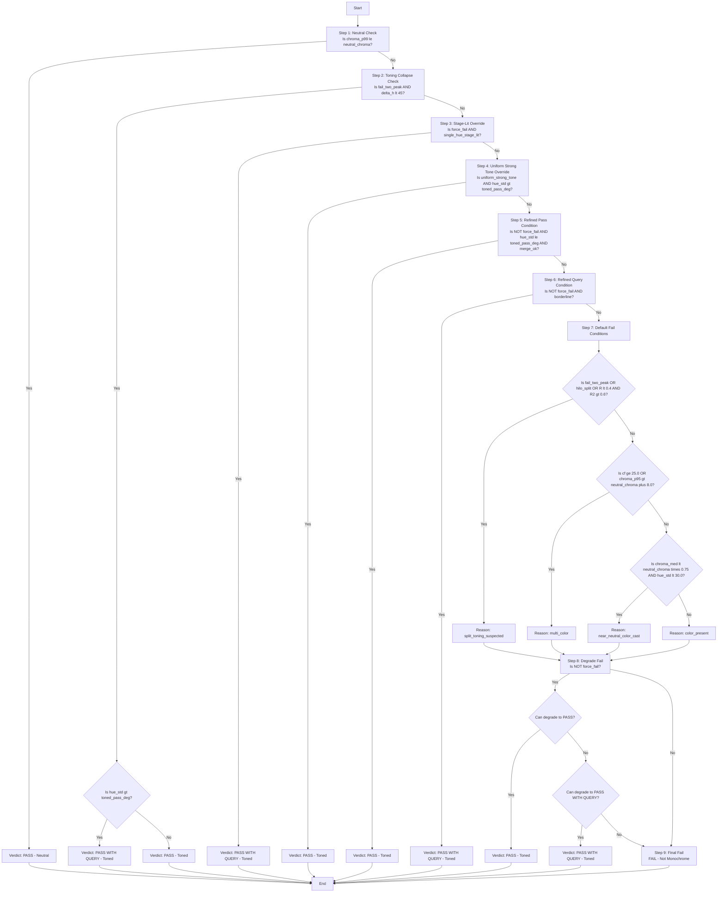

# Monochrome Checker Decision Tree (Technical Reference, v3)

*For a more user-friendly summary, see: [Monochrome Checker Logic](MONOCHROME_CHECKER_LOGIC.md)*

---

## Purpose and Audience

This document is a detailed, technical mapping of the monochrome checker’s logic, written in plain English but closely following the code. It is intended for developers, advanced users, and anyone debugging or extending the checker. Variable names and thresholds are included to help link the explanation to the Python codebase.

---

## Key Concepts, Variables, and Thresholds

The checker's logic relies on a set of specific metrics and configurable thresholds.

| Variable/Concept         | Default   | Description                                                                 |
|-------------------------|-----------|-----------------------------------------------------------------------------|
| neutral_chroma          | 2.0 C*    | A chroma threshold below which pixels are considered essentially neutral.    |
| toned_pass_deg          | 10.0°     | Max circular hue std-dev (σ) for clear PASS as toned monochrome.             |
| toned_query_deg         | 14.0°     | Max hue std-dev (σ) for PASS WITH QUERY.                                    |
| force_fail              | Flag      | Indicates strong, widespread color that should generally fail, unless overridden. |
| uniform_strong_tone     | Override  | Exception for very strong but highly uniform tones.                          |
| single_hue_stage_lit    | Override  | Exception for large neutral shadow region but single-hue subject.            |
| merge_ok                | Condition | True if secondary hue peaks are close (Δh ≤ 12°) or have insignificant mass (<10%). |
| fail_two_peak           | Condition | True if two distinct hue peaks are found, separated by Δh ≥ 15° and secondary mass ≥10%. |
| hilo_split              | Condition | True if hue difference between highlights and shadows is significant (Δh ≥ 45°). |
| R (Hue Concentration)   | Metric    | Resultant length of circular mean of hues (near 1.0 = tight concentration).  |
| R2 (Hue Bimodality)     | Metric    | Resultant length of doubled hues (high >0.6 = two clusters).                 |
| large_drift             | Condition | True if monotonic hue shift across tonal range (abs(hue_drift) > 120°).      |

---

## Decision Flow Diagram


The checker evaluates an image through the following sequence of conditions. The first condition met determines the verdict.



---

## Detailed Explanation of Each Step

### 1. Neutral Monochrome Check (Diagram Nodes B, C)
**Purpose:** Quickly identify images that are truly grayscale with negligible color.

**Criteria:** `chroma_p99 <= neutral_chroma`

The 99th percentile of chroma values across the image is below the neutral threshold (default 2.0). This means 99% of the pixels have a chroma value less than or equal to this number.

**Outcome:** PASS (Neutral Monochrome).

### 2. Toning Collapse Check (Diagram Nodes D, E, F, G)
**Purpose:** Reclassify images that might initially appear split-toned (due to two distinct hue peaks) but where the highlights and shadows actually fall within the same general hue family. This prevents false positives for split-toning.

**Criteria:** `fail_two_peak` is true AND `delta_h_highs_shadows_deg < 45.0`

The image has two dominant hue peaks that are significantly separated (>= 15.0°) and both have substantial mass (>= 10%).

BUT, the hue difference between the highlights and shadows is less than 45°, suggesting they are part of the same broad hue family.

**Outcome:**

- If `hue_std > toned_pass_deg`: PASS WITH QUERY (Toned). The toning collapsed, but the overall hue variation is still wider than a clear pass.
- Otherwise: PASS (Toned). The toning collapsed to a single hue family.

### 3. Stage-Lit Override (Diagram Nodes H, I)
**Purpose:** Correctly classify images that have a strong color element in the subject but a largely neutral background, common in stage photography.

**Criteria:** `force_fail` is true AND `single_hue_stage_lit` is true

The image has strong, widespread color that would normally fail, but it also has a large neutral-shadow region (>55%) with a subject that has a single, dominant hue.

**Outcome:** PASS WITH QUERY (Toned).

### 4. Uniform Strong Tone Override (Diagram Nodes J, K)
**Purpose:** Allow images with a very strong but consistent single tone (e.g., a deeply sepia-toned image) to pass, even if their overall hue spread is slightly wider than the standard pass threshold.

**Criteria:** `uniform_strong_tone` is true AND `hue_std > toned_pass_deg`

The image has a narrow hue spread (<= 14.0°), high hue concentration (R >= 0.85), a very dominant primary hue (>= 97%), and a significant presence of strong color.

**Outcome:** PASS (Toned).

### 5. Refined Pass Condition (Diagram Nodes L, M)
**Purpose:** The primary condition for an image to be considered a clear "pass" as a toned monochrome.

**Criteria:** NOT `force_fail` AND `hue_std <= toned_pass_deg` AND `merge_ok`

The hue standard deviation is within the tight "pass" limit (default 10.0°).

No significant split-toning is detected (either no second peak, or it's too close or too weak).

**Outcome:** PASS (Toned).

### 6. Refined Query Condition (Diagram Nodes N, O)
**Purpose:** Flag images for review that are borderline toned monochromes.

**Criteria:** NOT `force_fail` AND (`hue_std <= toned_query_deg` OR a moderately separated second peak with small mass exists).

The hue standard deviation is within the "query" limit (default 14.0°).

OR: There is a detected second hue peak that is moderately separated (12.0° < Δh <= 18.0°) but has a relatively small mass (< 15%).

**Outcome:** PASS WITH QUERY (Toned).

### 7. Default Fail Conditions (Diagram Nodes P-W)
**Purpose:** If no pass/query condition is met, this determines the specific reason for failure.

**Conditions (evaluated in order):**

- **Split-Toning Suspected:** `fail_two_peak` is true OR `hilo_split` is true OR (`R < 0.4` AND `R2 > 0.6`).
- **Multi-Color:** colorfulness >= 25.0 OR chroma_p95 > neutral_chroma + 8.0.
- **Near-Neutral Color Cast:** chroma_med < neutral_chroma * 0.75 AND hue_std < 30.0.
- **Color Present (General):** The default if no other reason fits.

### 8. Degrade to Pass/Query (from an initial Fail) (Diagram Nodes X, Y, Z, AA, BB)
**Purpose:** Re-evaluate some "fail" verdicts and downgrade them if the color is minor or subtle.

**Criteria (only if NOT force_fail):**

- **Degrade to PASS:** If the color footprint is very small and the hue spread is contained.
- **Degrade to PASS WITH QUERY:** If the color footprint is moderate or subtle.

**Outcome:** Can change a FAIL to PASS (Toned) or PASS WITH QUERY (Toned).

### 9. Final Fail (Diagram Node CC)
**Purpose:** If an image still remains a "fail" after all degradation checks, it is definitively classified as not monochrome.

**Outcome:** FAIL (Not Monochrome).

---

## Mapping to Code

- Main logic: `check_monochrome` and `_check_monochrome_lab` in `src/imageworks/libs/vision/mono.py`
- CLI and config: `src/imageworks/apps/competition_checker/cli/mono.py`
- Constants: Defined at the top of `mono.py`
- Output structure: `MonoResult` dataclass

---

## Example Output Mapping

A typical result dictionary (see `_result_to_json` in `cli/mono.py`):

```json
{
	"verdict": "pass_with_query",
	"mode": "toned",
	"hue_std_deg": 13.2,
	"dominant_color": "orange",
	"failure_reason": null,
	...
}
```

`verdict` and `mode` map to the main decision outcome.

`hue_std_deg`, `dominant_color`, and other metrics are used in the logic steps above.
