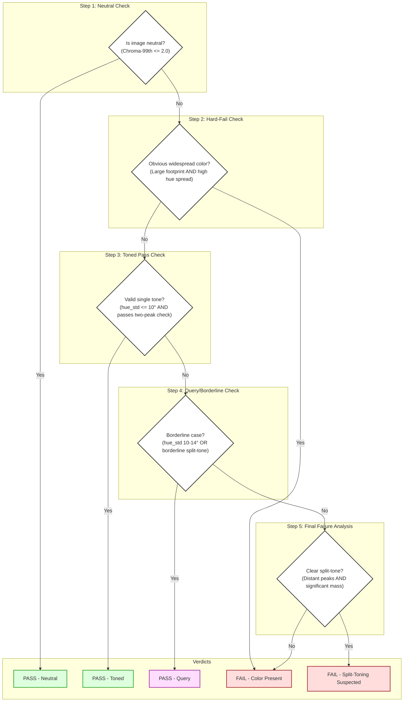

# Monochrome Checker Logic: A Decision Tree

*For a detailed technical mapping of the code logic, see: [Monochrome Checker Decision Tree](MONOCHROME_CHECKER_DECISION_TREE.md)*
---

## Glossary

- **Chroma**: The intensity or purity of color. In this context, low chroma means nearly neutral (gray), high chroma means strong color.
- **Hue**: The attribute of a color that lets us classify it as red, yellow, green, etc. Hue is measured in degrees around a color wheel.
- **Split-tone**: An image with two distinct color tones, often in highlights and shadows.
- **Toned**: An image with a single, consistent color tint (e.g., sepia).
- **Neutral**: An image with no discernible color tint—pure black, white, and gray.
- **Query**: A result where the checker is unsure and flags the image for human review.
- **Override**: A special rule that allows an image to pass or be flagged for review even if it would otherwise fail, based on specific characteristics (e.g., strong but uniform tone, stage lighting).
- **Degrade**: The process of downgrading a fail to a pass or query if the color presence is minor or subtle.

---

This document outlines the step-by-step logic the Imageworks Competition Checker uses to determine if an image is a valid monochrome. The logic is designed to be consistent with FIAP/PSA definitions, which allow for neutral black-and-white images as well as images toned with a single, consistent hue.

### Guiding Principles

- **Perceptual Accuracy:** All color and hue measurements are performed in the LAB color space and are weighted by chroma (color intensity) to better align with human perception.
- **Lenience on Borderline Cases:** The logic aims to flag ambiguous images for human review (`Query`) rather than failing them outright, especially when a color cast is very subtle or covers a microscopic area.
- **Robust Split-Tone Detection:** A two-peak hue analysis is used to differentiate between an acceptable color wobble within a single tone and a true, multi-toned image.

### A Note on Color Profiles

For the most accurate analysis, the checker needs to understand the colors of an image in a standardized color space (`sRGB`).

-   **Profiled Images:** If an image has an embedded color profile (e.g., Adobe RGB, ProPhoto RGB), the tool uses this profile to correctly convert the image's colors to sRGB before analysis. This is the ideal workflow.
-   **Untagged Images:** If an image has **no** embedded color profile, the checker has no choice but to **assume** it uses a standard sRGB-like color space.

**Why this matters:** If you provide an untagged image that was saved in a wide-gamut color space (like Adobe RGB), its colors will appear more saturated and may be misinterpreted by the checker. This can sometimes cause a subtly toned monochrome image to be flagged as having more color than it actually does. For best results, ensure your images are saved with their ICC color profiles embedded.

---

### Interpreting the Results: Judging the Output, Not the Method

A critical distinction for judges is that the checker analyzes the final rendered pixels of an image, not the photographer's editing process.

From pixels alone, we can reliably tell whether the resulting image reads as (i) neutral, (ii) single-toned, or (iii) split-toned. What we cannot do with certainty is prove whether the photographer applied a "split-toning" tool in their software.

#### Many-to-One Mapping
Different editing pipelines can lead to the same final result. A split-toning tool with a strong balance pushed to one side can create a single-toned output. Conversely, a single tint combined with complex curve adjustments can mimic a weak split-tone.

**Competition Rules:** Salon rules (FIAP/PSA) are concerned with the final image. If the output exhibits a single, uniform tone, it should pass as monochrome, regardless of the tools used to create it. If the output shows two or more distinct tones, it should fail.

The checker is aligned with this principle: it judges the result, not the artist’s intent or method.

---

## The Decision Tree

The logic is applied after the image has been loaded and analyzed to gather key metrics. It follows this sequence:

**Step 1: Check for True Neutral**

-   **Question:** Is the image almost perfectly black and white, with no discernible tint?
-   **Test:** The tool checks if the chroma (color intensity) of even the most colorful pixels (ignoring the top 1% of outliers) is below a tiny threshold (`C*99 ≤ 2.0`).
-   **Result:**
    -   **YES:** ➡️ **VERDICT: PASS (Neutral)**. The image is considered a true neutral monochrome.
    -   **NO:** ➡️ Proceed to the next step.

---

**Step 2: Check for Obvious, Widespread Color**

-   **Question:** Does the image have a large area of obvious color and significant color variation, making it an almost certain failure?
-   **Test:** This is a "hard fail" check. It fails if **ALL** of the following are true:
    1.  The most colorful pixels are clearly visible (`C*99 ≥ 6.0`).
    2.  A large portion of the image is colored (over 10% of pixels have visible color, or a single colored patch covers over 8%).
    3.  The color varies significantly (`hue_std > 10°`).
    4.  The image doesn't qualify for the "Uniform Strong Tone" exception (see below).
-   **Result:**
    -   **YES:** ➡️ **VERDICT: FAIL (Color Present)**. The image has too much color variation over too large an area.
    -   **NO:** ➡️ Proceed to the next step. The color is either not widespread or not varied enough for an automatic failure.

---

**Step 3: Check for Valid Single-Toned Images**

-   **Question:** Is the image a legitimate, consistently toned monochrome (like a classic sepia or selenium print)?
-   **Test:** The image passes if it has a tight, consistent tint. This is true if **BOTH** of the following conditions are met:
    1.  **Low Hue Variation:** The color that *is* present is very consistent across the image (`hue_std ≤ 10°`).
    2.  **Passes Two-Peak Check:** If two main "hues" are detected, they are either so close they are perceived as one (e.g., yellow and orange, `delta < 12°`), OR the second hue is insignificant (its "mass" is less than 10% of the main one). This prevents images with a minor, acceptable color wobble from failing.
-   **Result:**
    -   **YES:** ➡️ **VERDICT: PASS (Toned)**. The image is a valid toned monochrome.
    -   **NO:** ➡️ Proceed to the next step.

---

**Step 4: Check for Borderline Cases (Query)**

-   **Question:** Is the image not a clear pass, but also not a definite fail?
-   **Test:** The image is flagged for human review if it's in a "caution" zone. This happens if **EITHER** of these is true:
    1.  **Moderate Hue Variation:** The color variation is in a middle range—not tight enough to pass, but not wide enough to fail outright (`10° < hue_std ≤ 14°`).
    2.  **Borderline Split-Tone:** The two-peak analysis finds two distinct hues, but the case is borderline (e.g., peak delta between 12-18° and the second peak has less than 15% mass).
-   **Result:**
    -   **YES:** ➡️ **VERDICT: PASS (Query)**. The image is flagged for a judge to make the final call.
    -   **NO:** ➡️ Proceed to the final step.

---

**Step 5: Final Verdict (Fail)**

-   **Question:** If the image has reached this point, what is the reason for failure?
-   **Test:** An image that isn't a Neutral Pass, Toned Pass, or Query is a Fail. The logic assigns a specific reason:
    1.  **Clear Split-Tone:** The two-peak analysis finds two distinct hues that are far apart (`delta ≥ 15°`) and the second hue is significant (`mass ≥ 10%`).
    2.  **General Color:** If it doesn't meet the split-tone criteria, it fails simply because its color variation (`hue_std`) was too high.
-   **Result:**
    -   ➡️ **VERDICT: FAIL (Split-Toning Suspected or Color Present)**.

---

### Rationale for Two-Peak Thresholds

The thresholds used in the two-peak analysis (`pass if delta < 12°`, `fail if delta ≥ 15°`) are based on common color grading and photographic printing practices.

-   **Acceptable "Wobble" (`< 12°`):** A single light source or toning process can produce minor hue variations or "wobbles," typically staying within a 10-12° range. The logic treats these as a single, valid tone.
-   **Intentional Split-Toning (`> 120°`):** Common artistic split-tones, such as the popular "teal-and-orange" look, use near-complementary colors. This results in hue separations of 120° to 180° on the color wheel.
-   **The "Fail" Threshold (`≥ 15°`):** The 15° threshold for failure is chosen as a conservative boundary. It's wide enough to allow for natural wobbles but narrow enough to reliably catch even subtle, intentional split-toning that violates the "single hue" rule of monochrome competitions. Any separation greater than this, when the secondary tone has a significant presence (mass ≥ 10%), is flagged as a likely split-tone.

### Important Exceptions & Overrides

-   **Uniform Strong Tone:** An image with a very strong, saturated color (like a deep blue cyanotype) can still **PASS** if that color is extremely consistent across the entire frame. The logic has a specific override for this case.
-   **Tiny Leak Downgrade:** If an image would otherwise fail, but the actual colored pixels cover a microscopic portion of the image (e.g., less than 1%), the verdict is often downgraded from `FAIL` to `PASS (Query)` to be lenient on tiny, insignificant color halos.
-   **Stage Lighting:** A special override exists to handle cases where a mostly-neutral scene has a single, strong colored light on a subject. These are typically flagged as a `Query` instead of a `Fail`.
