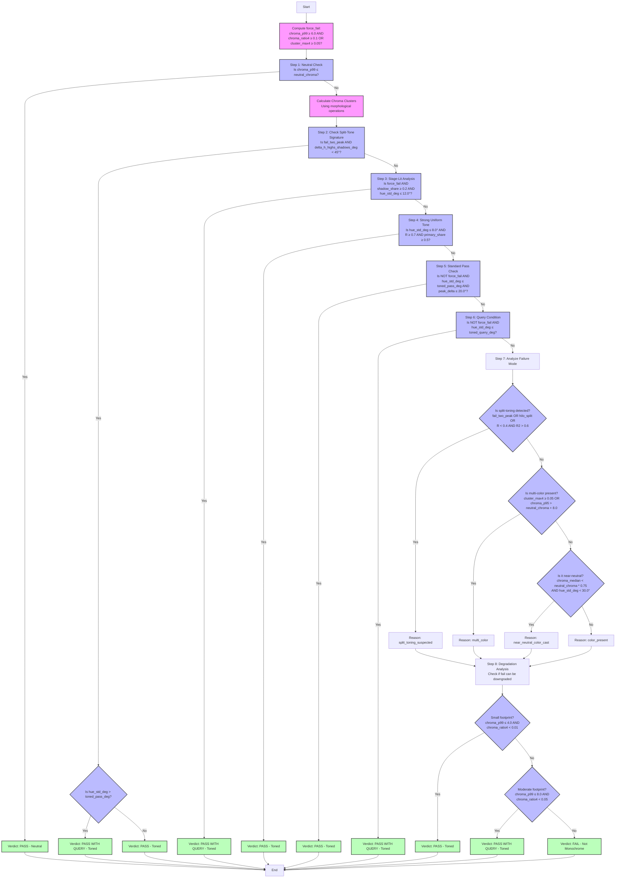

# Monochrome Checker Technical Documentation

*For ---iendly overview, see: [Monochrome Overview](monochrome-overview.md)*

## Introduction

This technical documentation provides a comprehensive reference for the monochrome image classification system. It covers the implementation details, algorithms, and decision logic used to determine whether an image qualifies as monochrome according to competition rules.

### Purpose and Audience

This documentation serves multiple roles:

**Primary Goals**
- Provide detailed technical understanding of the classification process
- Document implementation decisions and their rationales
- Serve as a reference for developers maintaining or extending the system

**Intended Audience**
- Developers working on the codebase
- Technical users implementing the system
- Competition judges understanding edge cases

### System Overview

The monochrome checker analyzes images through several key phases:

1. **Image Loading and Color Space Normalization**
   - ICC profile handling
   - sRGB conversion
   - Image scaling for performance

2. **LAB Color Space Analysis**
   - CIELAB color space conversion
   - Perceptual color metrics computation
   - Chroma and luminance analysis

3. **Circular Statistics Computation**
   - Hue concentration measurement
   - Bimodality detection
   - Weighted circular means

4. **Decision Tree Evaluation**
   - Fast-path neutral checks
   - Split-tone detection
   - Stage lighting adjustments

5. **Result Classification**
   - Core verdict determination
   - Confidence assessment
   - Explanation generation

---ome Checker Decision Tree (Technical Reference, v3)

*For a more user-friendly summary, see: [Monochrome Overview](monochrome-overview.md)*

---

## Purpose and Audience

This document is a detailed, technical mapping of the monochrome checker’s logic, written in plain English but closely following the code. It is intended for developers, advanced users, and anyone debugging or extending the checker. Variable names and thresholds are included to help link the explanation to the Python codebase.

## Core Concepts and Algorithms

### Color Space Analysis

The system operates primarily in the CIELAB (LAB) color space, which provides perceptually meaningful color measurements:

1. **Color Components**
   - L*: Lightness [0-100]
   - a*: Green-red axis [-128 to +127]
   - b*: Blue-yellow axis [-128 to +127]

2. **Derived Metrics**
   ```python
   # Polar coordinates in a*b* plane
   chroma = sqrt(a*² + b*²)    # Color intensity
   hue = arctan2(b*, a*)       # Color angle
   ```

### Statistical Methods

#### Circular Statistics
For analyzing periodic hue values, we use circular statistics:

1. **Hue Concentration (R)**
   - Measures how tightly clustered the hues are
   - R = 1.0 indicates perfect concentration
   ```python
   R = |Σ(w_i * e^(iθ_i))| / Σw_i
   ```

2. **Hue Bimodality (R2)**
   - Detects opposing hue clusters (split-toning)
   - High R2 with low R indicates bimodal distribution
   ```python
   R2 = |Σ(w_i * e^(2iθ_i))| / Σw_i
   ```

#### Cluster Analysis
The system uses morphological operations to detect connected regions of color:

1. **Chroma Clusters**
   - Identifies significant color regions
   - Uses adaptive kernel size based on image dimensions
   - Prevents false positives from isolated pixels

2. **Shadow Detection**
   - Identifies low-luminance, low-chroma regions
   - Special handling for stage-lit images

### Key Metrics

1. **Primary Metrics**
   - `chroma_p99`: 99th percentile chroma (color intensity)
   - `hue_std_deg`: Circular standard deviation of hues
   - `cluster_max4`: Largest high-chroma cluster size

2. **Derived Conditions**
   ```python
   force_fail = (
       chroma_p99 >= 6.0 and
       (chroma_ratio4 >= 0.1 or cluster_max4 >= 0.05) and
       hue_std_deg > toned_pass_deg
   )

   uniform_strong_tone = (
       hue_std_deg <= 8.0 and
       hue_concentration >= 0.7 and
       primary_share >= 0.5
   )
   ```

## Decision Flow

The checker evaluates an image through a carefully ordered sequence of conditions, optimizing for both accuracy and performance. The flow is designed to quickly identify clear cases while providing thorough analysis for edge cases.

### Core Decision Pipeline



### Decision Step Details

1. **Neutral Check** (Fast Path)
   - Purpose: Quickly identify true grayscale images
   - Condition: `chroma_p99 <= neutral_chroma` (2.0)
   - Outcome: PASS (Neutral) if true

2. **Split-Tone Analysis**
   - Purpose: Handle images with apparent split-toning
   - Conditions:
     - `fail_two_peak`: True if distinct hue peaks found
     - `delta_h_highs_shadows_deg < 45°`: Highlights/shadows in same hue family
   - Outcomes:
     - PASS WITH QUERY if `hue_std_deg > toned_pass_deg`
     - PASS if `hue_std_deg <= toned_pass_deg`

3. **Stage-Lit Override**
   - Purpose: Handle theatrical photography
   - Conditions:
     - `force_fail`: True for strong color presence
     - `shadow_share >= 0.2`: Significant dark areas
     - `hue_std_deg <= 12.0°`: Consistent toning
   - Outcome: PASS WITH QUERY if all conditions met

4. **Strong Uniform Tone**
   - Purpose: Allow deeply toned but consistent images
   - Conditions:
     - `hue_std_deg <= 8.0°`: Very tight hue spread
     - `R >= 0.7`: High hue concentration
     - `primary_share >= 0.5`: Dominant primary hue
   - Outcome: PASS if all conditions met

5. **Standard Pass**
   - Purpose: Main path for well-behaved toned images
   - Conditions:
     - NOT `force_fail`: No strong color indicators
     - `hue_std_deg <= toned_pass_deg`: Within standard limits
     - `peak_delta <= 20.0°`: No significant hue splits
   - Outcome: PASS if all conditions met

6. **Query Condition**
   - Purpose: Flag borderline cases for review
   - Condition: `hue_std_deg <= toned_query_deg`
   - Outcome: PASS WITH QUERY if true

7. **Failure Analysis**
   - Purpose: Determine specific reason for failure
   - Categories:
     - Split-toning suspected
     - Multi-color present
     - Near-neutral color cast
     - General color presence

8. **Degradation Check**
   - Purpose: Potentially downgrade fails with minor issues
   - Conditions:
     - Small footprint: `chroma_p99 <= 4.0 AND chroma_ratio4 < 0.01`
     - Moderate footprint: `chroma_p99 <= 8.0 AND chroma_ratio4 < 0.05`
   - Outcomes:
     - PASS for small footprint
     - PASS WITH QUERY for moderate footprint
     - FAIL otherwise

### Core Thresholds

These thresholds are carefully calibrated for competition standards:

| Category | Threshold | Purpose |
|----------|-----------|----------|
| Neutral | C* ≤ 2.0 | Define effectively neutral pixels |
| Toned Pass | σ ≤ 10.0° | Clear pass for toned images |
| Toned Query | σ ≤ 14.0° | Borderline cases needing review |
| Force Fail | C*₉₉ ≥ 6.0 | Strong color presence |

*Note: These thresholds can be adjusted via configuration for different requirements.*

| Variable                        | Default | Description                                                        |
|--------------------------------|---------|--------------------------------------------------------------------|
| LAB_STRONG_TONE_HUE_TOLERANCE  | 20.0°   | Max angular distance for merging nearby hue peaks                  |
| LAB_SHADOW_NEUTRAL_L           | 20.0    | Max L* value for shadow region detection                           |
| LAB_SHADOW_NEUTRAL_CHROMA      | 1.0 C*  | Max chroma for neutral shadow detection                            |
| LAB_STRONG_TONE_HUE_STD       | 8.0°    | Max hue std dev for strong uniform tone detection                  |
| LAB_STRONG_TONE_CONCENTRATION  | 0.7     | Min hue concentration (R) for strong tone detection                |
| LAB_STRONG_TONE_PRIMARY_SHARE  | 0.5     | Min primary hue share for strong tone detection                    |
| LAB_SHADOW_QUERY_SHARE        | 0.2     | Min shadow region fraction for stage-lit override                  |
| LAB_SHADOW_QUERY_HUE_STD      | 12.0°   | Max hue std dev for stage-lit override                            |
| LAB_SHADOW_QUERY_PRIMARY_SHARE | 0.2     | Min primary hue share for stage-lit override                      |
| LAB_HARD_FAIL_C4_RATIO_DEFAULT| 0.1     | Min ratio of high-chroma (C* > 4) pixels for hard fail            |
| LAB_HARD_FAIL_C4_CLUSTER_DEFAULT| 0.05   | Min cluster size of high-chroma pixels for hard fail              |

### Key Metrics and Formulas

#### Circular Statistics
```python
# Hue Concentration (R)
R = |Σ(w_i * e^(iθ_i))| / Σw_i
# where θ_i are hue angles in radians, w_i are chroma-based weights

# Hue Bimodality (R2)
R2 = |Σ(w_i * e^(2iθ_i))| / Σw_i
# High R2 with low R indicates bimodal distribution
```

#### Derived Conditions

| Condition           | Formula/Definition                                                    |
|--------------------|----------------------------------------------------------------------|
| force_fail         | chroma_p99 ≥ 6.0 AND (chroma_ratio4 ≥ 0.1 OR cluster_max4 ≥ 0.05)   |
| uniform_strong_tone| hue_std ≤ 8.0° AND R ≥ 0.7 AND primary_share ≥ 0.5                  |
| merge_ok          | peak_delta ≤ 20.0° OR second_mass < 0.1                              |
| fail_two_peak     | peak_delta ≥ 15.0° AND second_mass ≥ 0.1                            |
| hilo_split        | abs(mean_hue_highs - mean_hue_shadows) ≥ 45.0°                      |
| LAB_TONED_PASS_DEFAULT  | 10.0      | Default hue std-dev for a toned image to pass.                              |
| LAB_TONED_QUERY_DEFAULT | 14.0      | Default hue std-dev for a toned image to query.                             |
| LAB_STRONG_TONE_HUE_STD | 14.0      | Max hue std-dev for strong uniform tone override.                           |
| LAB_STRONG_TONE_CONCENTRATION | 0.85 | Min hue concentration (R) for strong uniform tone override.                 |
| LAB_STRONG_TONE_PRIMARY_SHARE | 0.97 | Min primary hue share for strong uniform tone override.                     |
| LAB_STRONG_TONE_HUE_TOLERANCE | 15.0° | Max angular distance for merging nearby hue peaks                                        |
| LAB_SHADOW_NEUTRAL_L    | 24.0      | Max L* for shadow region in stage-lit override.                             |
| LAB_SHADOW_NEUTRAL_CHROMA | 2.0     | Max chroma for neutral shadow region.                                       |
| LAB_SHADOW_QUERY_SHARE  | 0.55      | Min shadow share for stage-lit override.                                    |
| LAB_SHADOW_QUERY_HUE_STD | 24.0     | Max hue std-dev for stage-lit override.                                     |
| LAB_SHADOW_QUERY_PRIMARY_SHARE | 0.95 | Min primary hue share for stage-lit override.                               |
| LAB_HARD_FAIL_C4_RATIO_DEFAULT | 0.10 | Min ratio of C*4 pixels for hard fail.                                      |
| LAB_HARD_FAIL_C4_CLUSTER_DEFAULT | 0.08 | Min cluster fraction of C*4 pixels for hard fail.                           |
| CLUSTER_KERNEL_FRACTION | 0.08      | Kernel size fraction for chroma cluster morphology.                         |
| MERGE_DEG               | 12.0      | Max delta hue for two peaks to be considered one color.                     |
| FAIL_DEG                | 15.0      | Min delta hue for two peaks to be considered a genuine split.               |
| MINOR_MASS              | 0.10      | Min mass for a second hue peak to be significant.                           |
| HILO_SPLIT_DEG          | 45.0      | Min delta hue between highs and shadows for split signature.                |

---

---

## Detailed Explanation of Each Step

### Image Loading and Preprocessing

Before any analysis, the image is loaded and standardized:

1.  **Load Image:** The image is opened using `PIL.Image.open()`. Metadata (title, author) is extracted from XMP sidecar files or embedded XMP data.
2.  **ICC Profile Handling:** If an embedded ICC profile is found and `ImageCms` (LittleCMS) is available, the image is converted to sRGB using `ImageCms.profileToProfile()`. Otherwise, it's converted to standard RGB using `im.convert("RGB")`, assuming sRGB if no profile is present or handled.
3.  **Resizing:** If the longest side exceeds `max_side` (default 1024 pixels), the image is downscaled. This involves converting to linear RGB, resizing with `cv2.resize(interpolation=cv2.INTER_AREA)`, and converting back to sRGB.
4.  **Output:** An `np.ndarray` in sRGB (uint8) format and `LoaderDiagnostics` are returned.

### Color Space Analysis and Advanced Metrics

#### LAB Color Space Conversion

The sRGB image array is converted to CIELAB color space for perceptual color analysis:

```python
# Convert from sRGB to LAB
lab = cv2.cvtColor(rgb, cv2.COLOR_RGB2LAB).astype(np.float32)

# Extract and normalize components
L = lab[..., 0] * (100.0 / 255.0)  # Lightness [0, 100]
a = lab[..., 1] - 128.0            # a* [-128, 127]
b = lab[..., 2] - 128.0            # b* [-128, 127]

# Calculate polar coordinates
chroma = np.hypot(a, b)            # C* = sqrt(a*² + b*²)
hue_rad = np.arctan2(b, a)         # h° in radians
hue_deg = np.degrees(hue_rad) % 360.0  # h° in [0, 360)
```

#### Chroma Cluster Analysis

The checker uses morphological operations to detect significant connected regions of color:

```python
def _largest_cluster_fraction(mask: np.ndarray, kernel_frac: float = 0.1) -> float:
    """Calculate the largest connected component of high-chroma pixels.

    Args:
        mask: Binary mask of high-chroma pixels
        kernel_frac: Fraction of image size for morphological kernel

    Returns:
        Fraction of image covered by largest high-chroma cluster
    """
    if not mask.any():
        return 0.0

    # Create morphological kernel scaled to image size
    h, w = mask.shape
    kh = max(1, min(h, int(round(h * kernel_frac))))
    kw = max(1, min(w, int(round(w * kernel_frac))))
    kernel = np.ones((kh, kw), np.uint8)

    # Merge nearby regions with morphological closing
    closed = cv2.morphologyEx(mask.astype(np.uint8),
                            cv2.MORPH_CLOSE, kernel)

    # Find connected components
    num_labels, labels = cv2.connectedComponents(closed, connectivity=8)

    # Calculate largest cluster size
    if num_labels <= 1:
        return float(np.sum(mask[closed > 0])) / mask.size

    max_pixels = max(
        np.sum(mask[labels == label])
        for label in range(1, num_labels)
    )
    return float(max_pixels) / float(mask.size)
```

Two key cluster metrics are computed:
- `cluster_max2`: Largest connected region with C* > 2.0
- `cluster_max4`: Largest connected region with C* > 4.0

#### Circular Statistics

For analyzing hue distributions, the checker uses circular statistics to handle the periodic nature of hue angles:

```python
# Chroma-weighted circular mean
weights = np.clip(chroma / chroma.max(), 0, 1)  # Normalize weights
z = weights * np.exp(1j * hue_rad)              # Complex representation
z_mean = np.sum(z) / np.sum(weights)            # Weighted mean

# Circular statistics
R = abs(z_mean)                     # Concentration (0-1)
mean_hue = np.angle(z_mean)         # Mean hue angle

# Doubled angles for bimodality (R2)
z2 = weights * np.exp(2j * hue_rad)
z2_mean = np.sum(z2) / np.sum(weights)
R2 = abs(z2_mean)                   # Bimodality measure (0-1)

# Circular standard deviation
hue_std = np.sqrt(-2 * np.log(R))   # In radians
hue_std_deg = np.degrees(hue_std)    # Convert to degrees
```

Key circular metrics:
- `R`: Hue concentration (1.0 = perfect concentration)
- `R2`: Hue bimodality (high when two opposing hues present)
- `hue_std_deg`: Circular standard deviation of hues

**Key Chroma Statistics:**

-   `chroma_max`: Maximum chroma value.
-   `chroma_med`: Median chroma value.
-   `chroma_p95`, `chroma_p99`: 95th and 99th percentile chroma values (used to ignore extreme outliers).
-   `chroma_ratio2`, `chroma_ratio4`: Fraction of pixels with chroma > 2.0 and > 4.0 respectively.
-   `cluster_max2`, `cluster_max4`: Largest connected component (cluster) fraction for pixels with chroma > 2.0 and > 4.0, calculated using `_largest_cluster_fraction` (morphological closing with `CLUSTER_KERNEL_FRACTION` kernel, then connected components).

**Chroma-Weighted Circular Hue Statistics:**

-   A `mask` is created for pixels with `chroma > chroma_mask_threshold` (default 2.0). If no pixels meet this, a fallback mask of `chroma > 0.0` is used.
-   `chroma_norm = np.clip(chroma / chroma_max, 0.0, 1.0)` is used as weights.
-   `R` (Hue Concentration): Resultant length of the circular mean of hues, weighted by `chroma_norm`. A value near 1.0 indicates tight concentration.
-   `hue_std_deg`: Circular standard deviation of hues, weighted by `chroma_norm`. Measures hue spread.
-   `R2` (Hue Bimodality): Resultant length of doubled hues, weighted by `chroma_norm`. High values (>0.6) suggest two dominant hue clusters.
-   `mean_hue_deg`: Circular mean hue, weighted by `chroma_norm`.

**Hue Peaks Analysis (`_top_hue_peaks`):**

-   Identifies up to 3 dominant hue peaks using a 36-bin (10° per bin) circular histogram, weighted by `chroma_norm`.
-   Applies circular smoothing and detects local maxima.
-   Merges peaks that are closer than `LAB_STRONG_TONE_HUE_TOLERANCE` (15.0°) into a single peak.
-   `peak_hues`, `peak_weights`: Lists of dominant hue angles and their corresponding chroma-weighted masses.

**Split-Tone Gating Thresholds:**

-   `peak_delta_deg`: Circular difference between the top two hue peaks.
-   `second_mass`: Mass of the second dominant hue peak as a fraction of total weighted mass.
-   `merge_ok`: True if `peak_delta_deg <= MERGE_DEG` (12.0°) OR `second_mass < MINOR_MASS` (0.10).
-   `fail_two_peak`: True if `peak_delta_deg >= FAIL_DEG` (15.0°) AND `second_mass >= MINOR_MASS` (0.10).

**Lightness-Dependent Hue Analysis:**

-   `mean_hue_highs_deg`, `mean_hue_shadows_deg`: Circular mean hues for pixels in the top 25% (highlights) and bottom 25% (shadows) of the L* range, weighted by `chroma_norm`.
-   `delta_h_highs_shadows_deg`: Circular difference between `mean_hue_highs_deg` and `mean_hue_shadows_deg`.
-   `hilo_split`: True if `delta_h_highs_shadows_deg >= HILO_SPLIT_DEG` (45.0°).

**Shadow/Subject Share:**

-   `shadow_mask`: Pixels where `L <= LAB_SHADOW_NEUTRAL_L` (24.0) AND `chroma <= LAB_SHADOW_NEUTRAL_CHROMA` (2.0).
-   `shadow_share`: Fraction of pixels in `shadow_mask`.
-   `subject_share`: `1.0 - shadow_share` (capped at 0.0).

### 1. Neutral Monochrome Check (Diagram Nodes B, C)
**Purpose:** Quickly identify images that are truly grayscale with negligible color.

**Criteria:** `chroma_p99 <= neutral_chroma` (default 2.0)

The 99th percentile of chroma values across the image is below the neutral threshold. This means 99% of the pixels have a chroma value less than or equal to this number.

**Outcome:** PASS (Neutral Monochrome).

### 2. Toning Collapse Check (Diagram Nodes D, E, F, G)
**Purpose:** Reclassify images that might initially appear split-toned (due to two distinct hue peaks) but where the highlights and shadows actually fall within the same general hue family. This prevents false positives for split-toning.

**Criteria:** `fail_two_peak` is true AND `delta_h_highs_shadows_deg < HILO_SPLIT_DEG` (45.0°)

This means two dominant hue peaks are found (`peak_delta_deg >= FAIL_DEG` (15.0°) and `second_mass >= MINOR_MASS` (0.10)), BUT the hue difference between the highlights and shadows is less than 45°, suggesting they are part of the same broad hue family.

**Outcome:**

- If `hue_std_deg > toned_pass_deg` (10.0°): PASS WITH QUERY (Toned). The toning collapsed, but the overall hue variation is still wider than a clear pass.
- Otherwise: PASS (Toned). The toning collapsed to a single hue family.

### 3. Stage-Lit Override (Diagram Nodes H, I)
**Purpose:** Correctly classify images that have a strong color element in the subject but a largely neutral background, common in stage photography.

**Criteria:** `force_fail` is true AND `single_hue_stage_lit` is true

`force_fail` is true if: `chroma_p99 >= 6.0` AND (`chroma_ratio4 >= LAB_HARD_FAIL_C4_RATIO_DEFAULT` (0.10) OR `cluster_max4 >= LAB_HARD_FAIL_C4_CLUSTER_DEFAULT` (0.08)) AND `hue_std_deg > toned_pass_deg` (10.0°) AND NOT `uniform_strong_tone`.

`single_hue_stage_lit` is true if: `shadow_share >= LAB_SHADOW_QUERY_SHARE` (0.55) AND `subject_share >= 0.05` AND `hue_std_deg <= LAB_SHADOW_QUERY_HUE_STD` (24.0°) AND `primary_share >= LAB_SHADOW_QUERY_PRIMARY_SHARE` (0.95) AND `chroma_ratio4 >= 0.05`.

**Outcome:** PASS WITH QUERY (Toned).

### 4. Uniform Strong Tone Override (Diagram Nodes J, K)
**Purpose:** Allow images with a very strong but consistent single tone (e.g., a deeply sepia-toned image) to pass, even if their overall hue spread is slightly wider than the standard pass threshold.

**Criteria:** `uniform_strong_tone` is true AND `hue_std_deg > toned_pass_deg` (10.0°)

`uniform_strong_tone` is true if: `hue_std_deg <= LAB_STRONG_TONE_HUE_STD` (14.0°) AND `R >= LAB_STRONG_TONE_CONCENTRATION` (0.85) AND `primary_share >= LAB_STRONG_TONE_PRIMARY_SHARE` (0.97) AND `chroma_ratio4 >= 0.05`.

**Outcome:** PASS (Toned).

### 5. Refined Pass Condition (Diagram Nodes L, M)
**Purpose:** The primary condition for an image to be considered a clear "pass" as a toned monochrome.

**Criteria:** NOT `force_fail` AND `hue_std_deg <= toned_pass_deg` (10.0°) AND `merge_ok`

This means the hue standard deviation is within the tight "pass" limit, and no significant split-toning is detected (either no second peak, or it's too close or too weak).

**Outcome:** PASS (Toned).

### 6. Refined Query Condition (Diagram Nodes N, O)
**Purpose:** Flag images for review that are borderline toned monochromes.

**Criteria:** NOT `force_fail` AND (`hue_std_deg <= toned_query_deg` (14.0°) OR (`peak_delta_deg` is not None AND `MERGE_DEG` (12.0°) < `peak_delta_deg` <= 18.0° AND `second_mass < 0.15`))

This means the hue standard deviation is within the "query" limit, OR there is a detected second hue peak that is moderately separated but has a relatively small mass.

**Outcome:** PASS WITH QUERY (Toned).

### 7. Default Fail Conditions (Diagram Nodes P-W)
**Purpose:** If no pass/query condition is met, this determines the specific reason for failure.

**Conditions (evaluated in order):**

-   **Split-Toning Suspected:** `fail_two_peak` is true OR `hilo_split` is true OR (`R < 0.4` AND `R2 > 0.6`).
-   **Multi-Color:** `colorfulness` (`cf`) >= 25.0 OR `chroma_p95 > neutral_chroma + 8.0`.
-   **Near-Neutral Color Cast:** `chroma_med < neutral_chroma * 0.75` AND `hue_std_deg < 30.0`.
-   **Color Present (General):** The default if no other reason fits.

### 8. Degrade to Pass/Query (from an initial Fail) (Diagram Nodes X, Y, Z, AA, BB)
**Purpose:** Re-evaluate some "fail" verdicts and downgrade them if the color is minor or subtle.

**Criteria (only if NOT force_fail):**

-   **Degrade to PASS:** If (`small_footprint` is true OR (`soft_large_footprint` is true AND `chroma_ratio4 < 0.12`)) AND (`large_drift` is true OR `hue_std_deg < 45.0`).
    *   `small_footprint`: `chroma_p99 <= 4.0` AND `chroma_ratio4 < 0.01` AND `chroma_ratio2 < 0.08`.
    *   `soft_large_footprint`: `chroma_p99 < 6.0`.
    *   `large_drift`: `hue_drift_deg_per_l` is not None AND `abs(hue_drift_deg_per_l) > 120.0`.

-   **Degrade to PASS WITH QUERY:** If `moderate_footprint` is true OR `subtle_cast` is true OR `soft_large_footprint` is true OR (`large_drift` is true AND `chroma_ratio4 < 0.05`).
    *   `moderate_footprint`: `chroma_p99 <= 8.0` AND `chroma_ratio4 < 0.05` AND `chroma_ratio2 < 0.18`.
    *   `subtle_cast`: `chroma_p99 < 9.0` AND `chroma_ratio4 < 0.12`.

**Outcome:** Can change a FAIL to PASS (Toned) or PASS WITH QUERY (Toned).

### 9. Final Fail (Diagram Node CC)
**Purpose:** If an image still remains a "fail" after all degradation checks, it is definitively classified as not monochrome.

**Outcome:** FAIL (Not Monochrome).

---

## Implementation Reference

### API and Configuration

#### Primary Function

The main entry point for the monochrome checker is the `check_monochrome()` function:
```python
def check_monochrome(
    path: str,
    neutral_tol: int = 2,                    # Base tolerance for neutral detection
    toned_pass_deg: float = 10.0,           # Default pass threshold
    toned_query_deg: float = 14.0,          # Default query threshold
    *,
    max_side: int = 1024,                   # Max image dimension
    lab_neutral_chroma: float = 2.0,        # LAB-specific neutral threshold
    lab_chroma_mask: float = 2.0,           # Min chroma for hue analysis
    lab_toned_pass_deg: Optional[float] = None,    # Override pass threshold
    lab_toned_query_deg: Optional[float] = None,   # Override query threshold
    lab_hard_fail_c4_ratio: float = 0.1,    # High chroma ratio for hard fail
    lab_hard_fail_c4_cluster: float = 0.05  # High chroma cluster for hard fail
) -> MonoResult
```
Entry point for monochrome analysis. Handles image loading and parameter validation before delegating to `_check_monochrome_lab`.

#### Analysis Pipeline
Located in `src/imageworks/libs/vision/mono.py`:
1. `_load_srgb_array`: Image loading and ICC profile handling
2. `_check_monochrome_lab`: Main analysis pipeline
3. `_largest_cluster_fraction`: Chroma cluster analysis
4. `_circular_stats`: Circular statistics calculations
5. `_describe_verdict`: Human-readable result generation

### Configuration

Configuration is flexible and can be provided in multiple ways:

1. **Direct Function Arguments**
   ```python
   result = check_monochrome(
       "image.jpg",
       neutral_tol=2.0,
       toned_pass_deg=6.0,
       toned_query_deg=10.0
   )
   ```

2. **Project Configuration**
   ```toml
   # pyproject.toml
   [tool.imageworks.mono]
   neutral_tol = 2
   toned_pass_deg = 6.0
   toned_query_deg = 10.0
   lab_toned_pass_default = 10.0
   lab_toned_query_default = 14.0
   lab_chroma_mask = 2.0
   ```

3. **Environment Variables**
   ```bash
   export IMAGEWORKS_MONO_NEUTRAL_TOL=2.0
   export IMAGEWORKS_MONO_TONED_PASS_DEG=6.0
   ```

The configuration is layered with the following precedence:
1. Function arguments
2. Environment variables
3. Project configuration
4. Default values

### Result Structure
```python
@dataclass
class MonoResult:
    """Comprehensive analysis results."""
    # Core verdict
    verdict: Verdict              # "pass", "pass_with_query", "fail"
    mode: Mode                    # "neutral", "toned", "not_mono"
    reason_summary: str          # Human-readable explanation

    # Key metrics
    channel_max_diff: float      # Max RGB channel difference
    hue_std_deg: float          # Circular hue standard deviation
    dominant_hue_deg: float     # Principal hue angle
    hue_concentration: float    # Resultant length R [0,1]
    hue_bimodality: float      # Doubled angle measure R2 [0,1]

    # Chroma analysis
    chroma_max: float          # Maximum chroma value
    chroma_median: float       # Median chroma
    chroma_p95: float         # 95th percentile chroma
    chroma_p99: float         # 99th percentile chroma
    chroma_ratio_2: float     # Fraction with C* > 2
    chroma_ratio_4: float     # Fraction with C* > 4
    chroma_cluster_max_2: float # Largest C*>2 cluster
    chroma_cluster_max_4: float # Largest C*>4 cluster

    # Shadow analysis
    shadow_share: float       # Fraction in shadow region
    subject_share: float      # 1 - shadow_share

    # Advanced diagnostics
    hue_drift_deg_per_l: float # Hue change per L* unit
    hue_peak_delta_deg: float  # Separation of top hue peaks
    hue_second_mass: float    # Weight of secondary hue
    mean_hue_highs_deg: float # Mean hue in highlights
    mean_hue_shadows_deg: float # Mean hue in shadows
    delta_h_highs_shadows_deg: float # Highlight-shadow hue diff
    confidence: str           # "low", "normal" based on ICC
```

### Command-line Interface
Located in `src/imageworks/apps/mono_checker/cli/mono.py`:
```python
mono check IMAGE [OPTIONS]
Options:
  --neutral-tol FLOAT    Neutral tolerance [default: 2]
  --toned-pass FLOAT     Pass threshold [default: 6.0]
  --toned-query FLOAT    Query threshold [default: 10.0]
  --max-side INTEGER     Max image dimension [default: 1024]
```

### Tool Integration
The monochrome checker is integrated into:
1. Competition image processing pipeline
2. Batch analysis tools
3. XMP metadata writing tools for image catalogs

---

## Edge Cases and Special Handling

### Color Space Management

#### ICC Profile Handling
The checker carefully manages color spaces to ensure accurate analysis:

```python
def _load_srgb_array(path: str, max_side: int = 1024):
    """Load image as sRGB uint8, with ICC profile handling."""
    with Image.open(path) as im:
        icc_bytes = im.info.get("icc_profile")
        if icc_bytes and _IMAGECMS_AVAILABLE:
            # Convert using LittleCMS
            src_profile = ImageCms.ImageCmsProfile(io.BytesIO(icc_bytes))
            dst_profile = ImageCms.createProfile("sRGB")
            im = ImageCms.profileToProfile(im, src_profile, dst_profile)
            status = "embedded_converted_to_srgb"
        else:
            # Fallback conversion
            im = im.convert("RGB")
            status = "no_profile_assumed_srgb"
```

Color space confidence affects the final verdict:
- `normal`: Proper ICC profile conversion performed
- `low`: No profile or assumed sRGB conversion

### Near-Neutral Analysis

The checker uses multiple approaches to handle near-neutral pixels:

1. **Channel Delta Analysis**
   ```python
   # Quick check for perfect neutrality
   rgb_max = np.amax(rgb, axis=2)
   rgb_min = np.amin(rgb, axis=2)
   channel_max_diff = float(np.max(rgb_max - rgb_min))

   if channel_max_diff <= neutral_tol:
       return "pass", "neutral"
   ```

2. **Chroma Thresholding**
   - Pixels with C* < 2.0 are considered effectively neutral
   - Uses percentile analysis to handle noise:
   ```python
   if chroma_p99 <= neutral_chroma:
       return "pass", "neutral"
   ```

3. **Near-Neutral Color Cast Detection**
   ```python
   if (chroma_median < neutral_chroma * 0.75 and
       hue_std_deg < 30.0):
       failure_reason = "near_neutral_color_cast"
   ```

### Histogram Analysis

#### Hue Peak Detection
The checker uses a sophisticated peak detection system:

1. **Histogram Creation**
   ```python
   # 36 bins (10° per bin)
   hist, _ = np.histogram(
       hue_deg,
       bins=36,
       range=(0, 360),
       weights=chroma_norm
   )
   ```

2. **Peak Finding**
   - Applies circular smoothing to reduce noise
   - Identifies local maxima
   - Merges peaks within tolerance

3. **Peak Analysis**
   ```python
   # Check for significant secondary peaks
   if (peak_delta_deg >= 15.0 and
       second_mass >= 0.1):
       fail_two_peak = True
   ```

### Special Cases

1. **Stage-Lit Images**
   - Large neutral shadow area (≥20% of image)
   - Single-hue subject region
   - Special override to handle theatrical photography

2. **Strong Uniform Toning**
   - Very high chroma but extremely consistent hue
   - Overrides normal chroma limits for historical processes

3. **Split-Toning Detection**
   ```python
   # Check highlight/shadow hue difference
   if abs(mean_hue_highs_deg -
          mean_hue_shadows_deg) >= 45.0:
       hilo_split = True
   ```

### Result Confidence

Confidence is lowered when:
1. No ICC profile is available
2. ICC profile conversion fails
3. Image has been heavily compressed
4. Near-neutral pixels dominate the image

---

## Example Output

A typical result dictionary (see `_result_to_json` in `cli/mono.py`):

```json
{
    "verdict": "pass_with_query",
    "mode": "toned",
    "hue_std_deg": 13.2,
    "dominant_color": "orange",
    "failure_reason": null,
    "confidence": "normal",
    "icc_status": "embedded_converted_to_srgb",
    "chroma_footprint": {
        "ratio_2": 0.15,
        "ratio_4": 0.03,
        "cluster_max_2": 0.12,
        "cluster_max_4": 0.02
    },
    "hue_analysis": {
        "concentration": 0.92,
        "bimodality": 0.14,
        "peak_delta_deg": 8.5,
        "second_mass": 0.07
    }
}
```
